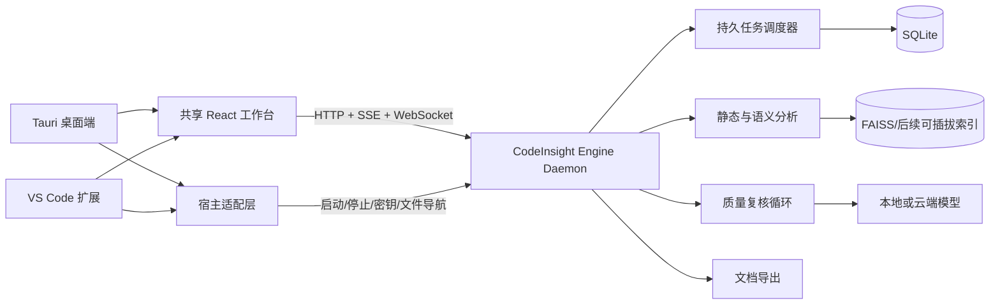

# CodeInsight-AI 产品架构与实施路线

## 1. 产品目标

CodeInsight-AI 是一个本地优先的持续代码理解工具，而不是部署在远端的网页服务。

最终交付形态：

- Windows 10/11、Windows Server 与主流 Ubuntu LTS 的桌面安装包。
- 可从 VS Code Marketplace 或 VSIX 安装的扩展。
- 桌面端与 VS Code 扩展共享同一个分析引擎和工作台。
- 支持运行数小时或整夜的持续分析，能够暂停、恢复、增量更新和自动复核。
- 输出包含代码证据、置信度和版本信息的 Markdown、Mermaid 与 JSON 文档。
- 默认在本机存储源码索引、分析状态和生成文档。

## 2. 产品原则

1. **本地优先**：源码、索引和文档默认不上传；仅将检索后的必要上下文发送给用户选择的模型。
2. **事实与推断分离**：AST、导入、调用和继承属于结构事实；功能、领域和架构说明属于语义推断。
3. **可追溯**：每条重要结论记录来源文件、行号、内容哈希、生成模型、时间和置信度。
4. **可恢复**：分析任务、检查点和失败原因持久化，进程或机器重启后可以继续。
5. **增量优先**：以文件内容哈希和依赖影响范围为基础，只重新分析发生变化的部分。
6. **多轮质量闭环**：生成、批判、证据核验、冲突解决和局部重写由不同阶段负责。
7. **宿主无关**：桌面端和 VS Code 扩展只负责宿主能力，不复制分析业务逻辑。

## 3. 目标架构



### 3.1 分析引擎

保留现有 `api/` FastAPI、RAG、仓库读取和 Wiki 生成能力，并将其改造成独立 daemon：

- 只监听 `127.0.0.1`，启动时生成随机端口和会话令牌。
- 使用 SQLite 保存项目、快照、任务、阶段、证据、结论和文档版本。
- 使用持久任务队列替代当前内存 `TaskRegistry`。
- 使用文件监听器和 Git diff 触发增量分析。
- 支持暂停、恢复、取消、夜间模式、预算和最大并发数。
- 通过 OpenAPI 契约向桌面端和 VS Code 扩展提供统一接口。

### 3.2 共享工作台

现有 Next.js 页面作为迁移来源，目标是可静态构建的 React 工作台：

- 不依赖 Next.js 服务端 Route Handler。
- API 地址和会话令牌由宿主在启动时注入。
- 同一套构建产物用于 Tauri WebView 和 VS Code Webview。
- 使用宿主桥接接口实现打开文件、跳转行号、选择文件夹和保存密钥。
- 中文为默认语言，保留英文切换能力。

### 3.3 桌面端

采用 Tauri 2：

- 安装包体积和内存占用低于 Electron。
- Windows 与 Ubuntu 均有成熟打包路径。
- 启动打包后的 Python daemon sidecar。
- 使用系统 Keychain/Secret Service 保存模型密钥。
- 提供系统托盘、后台运行、开机启动和自动更新。

Python daemon 使用 PyInstaller 分平台构建，不制作跨平台通用二进制。

### 3.4 VS Code 扩展

- TypeScript Extension Host。
- 使用 VS Code Webview 加载共享工作台。
- 使用 `SecretStorage` 保存密钥。
- 使用 Workspace API 选择分析根目录、监听文件和打开证据位置。
- 优先连接已运行的桌面 daemon；未运行时启动扩展自带 daemon。
- daemon 退出时不影响 VS Code Extension Host 稳定性。

## 4. 持续分析流水线

### 4.1 阶段

1. **扫描**：语言、框架、入口、构建系统、目录和 Git 状态。
2. **结构提取**：AST、符号、导入、调用、继承、配置和数据库定义。
3. **影响图构建**：跨文件依赖、模块边界、循环依赖和变更影响。
4. **局部语义理解**：函数、类、文件和模块功能摘要。
5. **系统综合**：领域、业务流程、架构模式、数据流和部署拓扑。
6. **独立复核**：Reviewer 查找缺失、矛盾、无证据结论和过度推断。
7. **证据核验**：重新读取被引用代码，确认结论仍与当前快照一致。
8. **局部修正**：只重写失败结论及其上层摘要。
9. **文档发布**：生成带版本和质量报告的 Markdown/Mermaid/JSON。

### 4.2 结论数据模型

每条结论至少包含：

```json
{
  "id": "claim-id",
  "scope": "module",
  "subject": "api/rag",
  "statement": "负责仓库索引和检索",
  "evidence": [
    {
      "path": "api/rag/pipeline.py",
      "line_start": 1,
      "line_end": 80,
      "content_hash": "sha256"
    }
  ],
  "confidence": 0.92,
  "status": "verified",
  "generator_model": "provider/model",
  "reviewer_model": "provider/model",
  "snapshot_id": "snapshot-id"
}
```

### 4.3 夜间分析模式

- 可设置持续时间、Token/金额预算、最大并发和空闲时段。
- 每个阶段完成后写入检查点。
- 模型限流采用指数退避，超过阈值进入等待状态而不是失败退出。
- 对低置信度、跨模块和高影响结论分配更多复核轮次。
- 文件发生变化时，使受影响结论失效并排入局部重分析。
- 夜间结束时输出新增认知、被修正结论、剩余疑点和预算报告。

## 5. 模型配置

模型按职责分开配置：

- **生成模型**：功能摘要、架构和文档。
- **嵌入模型**：代码检索。
- **复核模型**：独立检查和冲突解决。
- **快速模型**：分类、路由和低成本增量任务。

配置页面必须支持：

- OpenAI、Google、OpenRouter、DashScope、Azure、Bedrock、Ollama 和 OpenAI-compatible。
- 连接测试、模型列表发现、上下文长度和能力提示。
- API Base URL、代理、超时、并发和重试。
- 每小时、每任务和每项目预算。
- 密钥仅通过桌面 Keychain 或 VS Code SecretStorage 保存，不写入项目文件或日志。

## 6. 前端信息架构

参考开源项目的交互模式，但不复制品牌和受限制代码：

- AnythingLLM：桌面安装、项目空间和文档 RAG 工作流。
- Open WebUI：多模型管理、运行状态与参数配置。
- Continue/Cline：VS Code 侧栏、上下文和任务流。
- ArchLens/CodeVisualizer：架构图、证据导航和代码定位。

工作台一级导航：

1. 项目
2. 分析任务
3. 代码地图
4. 架构与业务流程
5. 分析文档
6. 质量报告
7. 模型与预算
8. 日志与诊断

## 7. 分阶段实施与验收

### 阶段 0：基线与品牌

- 建立产品规范、架构决策记录和 `.env.example`。
- 将产品名称统一为 CodeInsight-AI，中文为默认语言。
- 固化当前 API、测试和生成质量基线。

验收：新开发者可按文档启动；品牌入口统一；现有功能无回归。

### 阶段 1：持久分析引擎

- 引入 SQLite 数据层和迁移机制。
- 将 Wiki 内存任务迁移为持久任务。
- 增加暂停、恢复、取消、进度和事件流。
- 增加项目快照、文件哈希和任务检查点。

验收：分析中杀死进程并重启，任务可以从最近检查点继续。

### 阶段 2：模型与安全配置

- 建立统一 Provider/Model/Profile schema。
- 增加生成、嵌入、复核模型角色。
- 增加连接测试、预算与运行时密钥注入。

验收：Ollama 与至少一个云模型通过 UI 配置并完成端到端分析。

### 阶段 3：共享中文工作台

- 将页面拆为共享 React 包和宿主适配层。
- 移除 Next.js BFF 依赖。
- 实现项目、任务、文档、质量和模型页面。

验收：同一 UI 构建产物可在浏览器测试壳和 VS Code Webview 中运行。

### 阶段 4：Windows/Ubuntu 桌面端

- 增加 Tauri 2 工程和 daemon sidecar 管理。
- 增加系统密钥、托盘、后台运行和自动更新。
- 建立 MSI/NSIS 与 AppImage/deb 构建。

验收：全新 Windows 与 Ubuntu 环境可安装、启动、分析并卸载。

### 阶段 5：VS Code 扩展

- 增加扩展命令、Activity Bar、Webview 和工作区桥接。
- 集成 SecretStorage、文件跳转和 daemon 生命周期。

验收：VSIX 安装后可分析当前工作区，点击证据可打开对应行。

### 阶段 6：质量闭环

- 实现 Claim/Evidence 模型、独立 Reviewer 和冲突修正。
- 增加质量评分、覆盖率、过期检测和人工反馈。
- 增加夜间分析策略。

验收：固定样例仓库上的证据有效率、文档覆盖率和回归测试达到发布阈值。

### 阶段 7：发布

- 跨平台 CI、签名、SBOM、许可证检查、自动更新和崩溃诊断。
- 完成用户手册、迁移文档和隐私说明。

验收：桌面安装包和 VSIX 可重复构建，自动化端到端测试通过。

## 8. 当前已知优先风险

1. 当前任务状态只存在内存，必须在长时间分析前解决。
2. 当前缓存键未完整区分语言和生成模式，可能相互覆盖。
3. 当前默认生成模型与嵌入模型来自不同 Provider，首次配置容易失败。
4. 当前前端 Wiki 页面过大，需要在迁移共享 UI 前拆分。
5. 当前 Next.js BFF、FastAPI 和浏览器 WebSocket 的地址配置不统一。
6. 当前仓库同时存在 npm/yarn/Poetry/uv 痕迹，需要统一构建路径。
7. 需要逐项核验参考项目和新增依赖许可证，不直接复制第三方界面代码。

## 9. 非目标

- 第一阶段不提供多租户 SaaS。
- 第一阶段不将完整源码同步到产品服务器。
- 第一阶段不追求在同一个二进制中跨平台运行 Python 引擎。
- 不使用 VS Code Extension Host 执行高负载分析。
